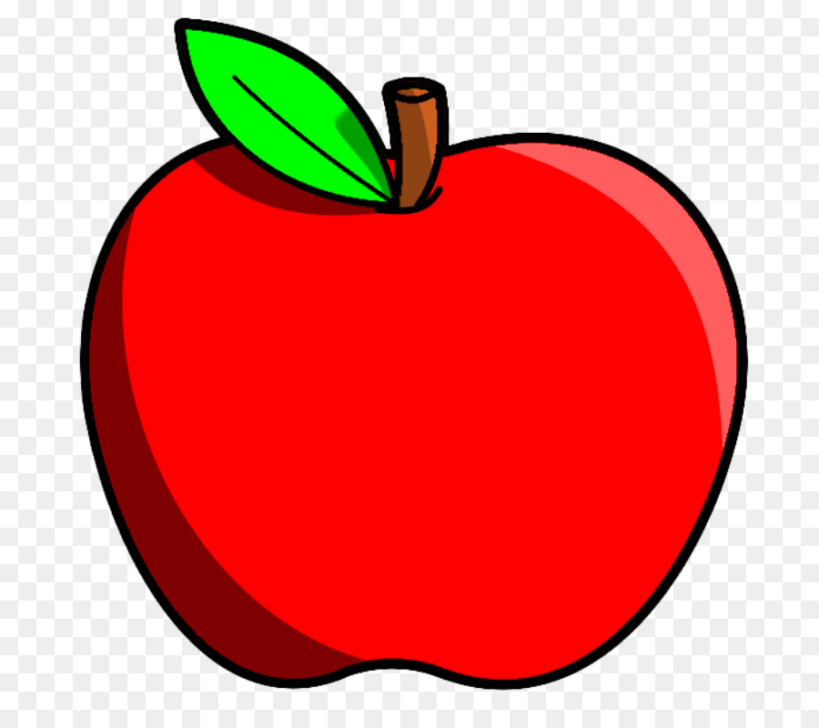

<!DOCTYPE html>
<html lang="en">
<head>
    <meta charset="utf-8">
    <meta name="viewport" content="width=device-width, initial-scale=1, shrink-to-fit=no">

    <link rel="stylesheet" href="../css/bootstrap.min.css">
    <link rel="stylesheet" href="../css/style.css">

    
    

    <title>Was Da Is(s)t!</title>

</head>
<body>

    

        

            

                
            

        

        

            <nav class="navbar navbar-expand-md navbar-dark bg-dark">

                <a class="navbar-brand navbar-brand-font" href="#">Was Da Is(s)t!</a>
                <button class="navbar-toggler" type="button" data-toggle="collapse"
                        data-target="#navbarSupportedContent"
                        aria-controls="navbarSupportedContent" aria-expanded="false" aria-label="Toggle navigation">
                    
                </button>

                

                    <ul class="navbar-nav ">
                        <li class="nav-item active">
                            <a class="nav-link" href="#">Home</a>
                        </li>
                        <li class="nav-item active">
                            <a class="nav-link" href="project.html">Das Projekt</a>
                        </li>
                        <li class="nav-item active">
                            <a class="nav-link" href="recipe.html">Rezepte</a>
                        </li>
                        <li class="nav-item active">
                            <a class="nav-link" href="billaShop.html">Billa - Shop</a>
                        </li>
                    </ul>
                

            </nav>

        

    

    

    <h1 class="mt-4">Heading</h1>
    

        Lorem ipsum dolor sit amet, consetetur sadipscing elitr, sed diam nonumy eirmod tempor invidunt ut labore et
        dolore magna aliquyam erat, sed diam voluptua. At vero eos et accusam et justo duo dolores et ea rebum. Stet
        clita kasd gubergren, no sea takimata sanctus est Lorem ipsum dolor sit amet. Lorem ipsum dolor sit amet,
        consetetur sadipscing elitr, sed diam nonumy eirmod tempor invidunt ut labore et dolore magna aliquyam erat, sed
        diam voluptua. At vero eos et accusam et justo duo dolores et ea rebum. Stet clita kasd gubergren, no sea
        takimata sanctus est Lorem ipsum dolor sit amet.
    

    <ul class="nav justify-content-end navbar-expand-sm bg-dark navbar-dark fixed-bottom mt-5">
        <li class="nav-item">
            <a class="nav-link text-white" href="html/career.html">Karriere</a>
        </li>
        <li class="nav-item">
            <a class="nav-link text-white" href="html/contact.html">Kontakt</a>
        </li>
        <li class="nav-item">
            <a class="nav-link text-white" href="html/siteNotice.html">Impressum</a>
        </li>
    </ul>

</body>
</html>
